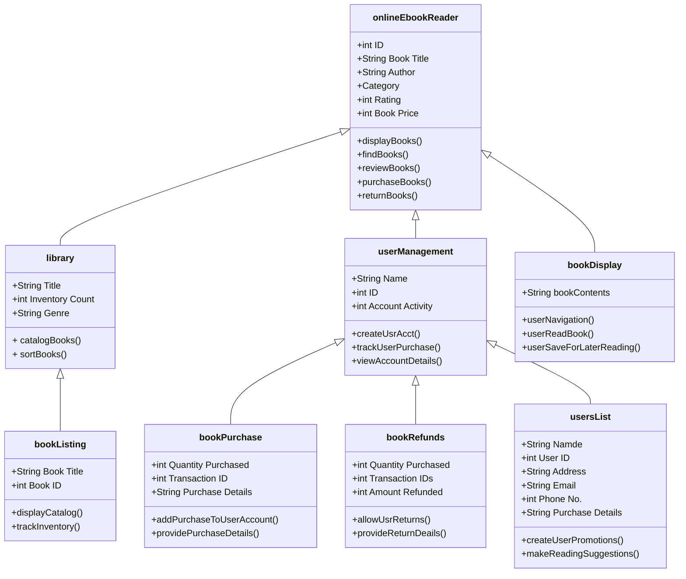

### Week_2 E-Book Reader

```mermaid
        classDiagram
    onlineEbookReader <|-- library
    onlineEbookReader <|-- userManagement
       userManagement <|-- bookPurchase
       userManagement <|-- bookRefunds
    onlineEbookReader <|-- bookDisplay
              library <|-- bookListing
       userManagement <|-- usersList
    onlineEbookReader : +int ID
    onlineEbookReader : +String Book Title
    onlineEbookReader : +String Author
    onlineEbookReader : +Category
    onlineEbookReader : +int Rating
    onlineEbookReader : +int Book Price
    onlineEbookReader : +displayBooks()
    onlineEbookReader : +findBooks()
    onlineEbookReader : +reviewBooks()
    onlineEbookReader : +purchaseBooks()
    onlineEbookReader : +returnBooks()
    
        class library{
        +String Title
        +int Inventory Count
        +String Genre
        + catalogBooks()
        + sortBooks()


    }
    class userManagement{
        +String Name
        +int ID
        +int Account Activity
        +createUsrAcct()
        +trackUserPurchase()
        +viewAccountDetails()
        
    }
    class bookPurchase{
        +int Quantity Purchased
        +int Transaction ID
        +String Purchase Details 
        +addPurchaseToUserAccount()
        +providePurchaseDetails()
    }
     class bookRefunds{
        +int Quantity Purchased
        +int Transaction IDs
        +int Amount Refunded
        +allowUsrReturns()
        +provideReturnDeails()

    }
    class bookDisplay{
        +String bookContents
        +userNavigation()
        +userReadBook()
        +userSaveForLaterReading()
    }
    class bookListing{
        +String Book Title
        +int Book ID
        +displayCatalog()
        +trackInventory()
        
    }
     class usersList{
        +String Namde
        +int User ID
        +String Address
        +String Email
        +int Phone No.
        +String Purchase Details
        +createUserPromotions()
        +makeReadingSuggestions()
        
    }
```