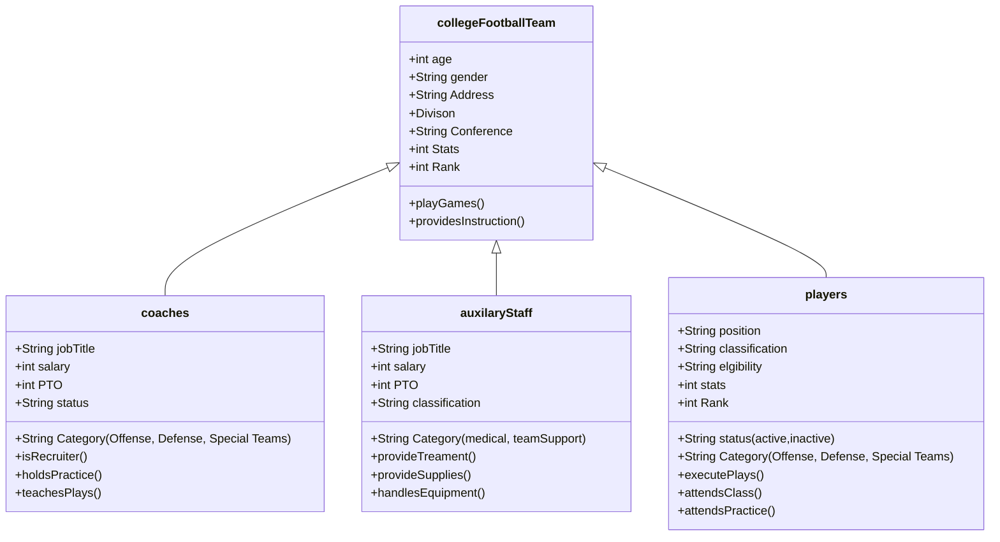

### Week_2 College Football Team Hierchary

```mermaid
        classDiagram
    collegeFootballTeam <|-- coaches
    collegeFootballTeam <|-- auxilaryStaff
    collegeFootballTeam <|-- players
    collegeFootballTeam : +int age
    collegeFootballTeam : +String gender
    collegeFootballTeam : +String Address
    collegeFootballTeam : +Divison
    collegeFootballTeam : +String Conference
    collegeFootballTeam : +int Stats
    collegeFootballTeam : +int Rank
    collegeFootballTeam : +playGames()
    collegeFootballTeam : +providesInstruction()

    
        class coaches{
        +String jobTitle
        +int salary
        +int PTO
        +String status
        +String Category(Offense, Defense, Special Teams)
        +isRecruiter()
        +holdsPractice()
        +teachesPlays()

    }
    class auxilaryStaff{
        +String jobTitle
        +int salary
        +int PTO
        +String classification
        +String Category(medical, teamSupport)
        +provideTreament()
        +provideSupplies()
        +handlesEquipment()
        
    }
    class players{
        +String position
        +String classification
        +String elgibility
        +int stats
        +int Rank
        +String status(active,inactive)
        +String Category(Offense, Defense, Special Teams)
        +executePlays()
        +attendsClass()
        +attendsPractice()
    }
```